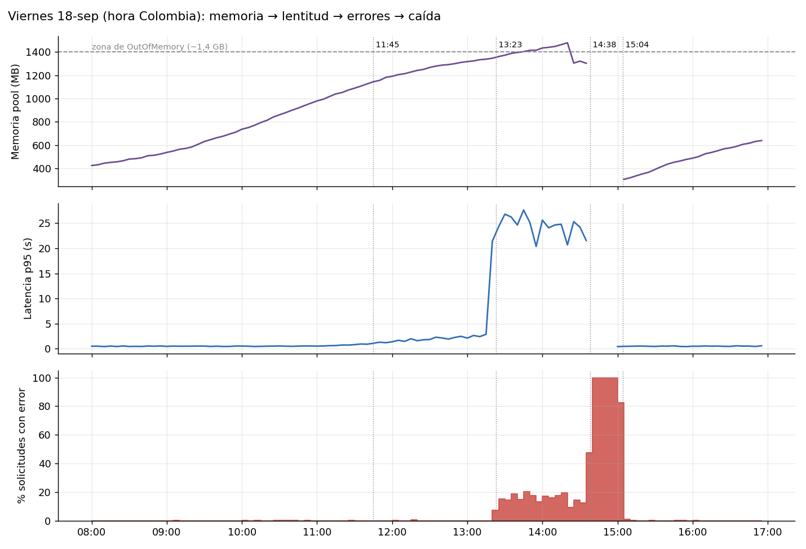

## Resumen en 5 líneas

1. **Qué pasó.** El viernes 18, último día de un plazo de pago, el portal estuvo lento desde las **11:45**, falló de forma intermitente desde las **13:23** y se cayó por completo entre las **14:38 y las 15:04** (26 minutos). Hubo **1 h 41 min con errores**, precedidos de casi 2 horas de lentitud.
2. **Por qué.** La versión **v2.3.1**, instalada el martes 15 a las 22:03, hace crecer la memoria del portal con cada pago confirmado (≈0,5 MB) y no la libera hasta el siguiente reinicio. Ese viernes hubo el doble de pagos de lo normal y el portal se quedó sin memoria.
3. **Por qué no lo vimos.** El NOC vigila con ping y con una página `/health` que respondía bien mientras los clientes recibían errores. El reinicio nocturno del .BAT borraba la memoria todos los días y escondía el problema.
4. **Disponibilidad real de la semana: 98,57 %**, frente al 100 % que reporta el NOC. El viernes fue de 94,5 %.
5. **Riesgos inmediatos.** El problema de memoria **sigue activo**, y el disco C: **se llenará hacia el martes 22 de septiembre al mediodía** si no se corrige.

## Qué vivieron los clientes (hora de Colombia)

| Hora | Qué pasó por dentro | Qué vio el cliente |
|---|---|---|
| 02:00 | El reinicio nocturno deja el portal "limpio" | Nada |
| 11:10 | La memoria del portal supera 1.000 MB, 3,3 veces lo normal | Nada todavía |
| **11:45** | **Empieza la degradación:** las respuestas tardan más del doble de lo normal | Lentitud al consultar y pagar |
| **13:23** | **Primer error del incidente** (los 17 errores previos del día son de otra consulta y ocurren a diario). Un minuto después aparece el primer "sin memoria" al confirmar un pago | "Ha ocurrido un error inesperado" en 1 de cada 7 operaciones, y en **4 de cada 10 intentos de pago** |
| 13:34 | Primer ticket (T-10252) | Llaman a la mesa de servicio |
| 14:22–14:38 | El portal se cae y se levanta solo 5 veces. A la quinta, IIS lo apaga como protección | Errores cada vez más frecuentes |
| **14:38** | **Caída total** | "Service Unavailable" en todo el portal |
| 14:42 | Ticket crítico (T-10255). El NOC no había alertado | — |
| **15:04** | **Recuperación:** alguien reinicia el pool a mano | El portal vuelve a funcionar |
| 15:30 | Tiempos y errores normales. En las 2 horas siguientes se confirman 694 pagos, al ritmo alto de todo el viernes | Normal |

{width=100%}

**Impacto medido:** 1.952 solicitudes fallidas, de las cuales **504 eran intentos de pago** (iniciar o confirmar): falló el **41 % de los intentos de pago** antes de la caída total y el **56 %** en todo el incidente. Antes de la caída total, los errores llegaron a **463 direcciones IP distintas**, una aproximación al número de clientes afectados; durante la caída el registro no permite distinguirlas. Las primeras alertas fueron de clientes: el primer ticket llegó 11 minutos después del primer error.

## Causa raíz y factores que contribuyeron

Separamos lo que muestran los datos (**hecho**) de lo que todavía hay que confirmar (**hipótesis**). La evidencia detallada, con archivo y línea, está en `HALLAZGOS_TECNICOS.md`.

**Causa raíz (hecho).** La memoria del portal crece en **≈0,5 MB por cada pago confirmado** y solo baja cuando se reinicia. Antes de v2.3.1 la memoria era plana, cerca de 300 MB. El modelo explica el 99,9 % de la variación. Los 40 errores de memoria apuntan al mismo componente nuevo: el *caché de sesiones de pago* (`SesionPagoCache.Agregar`), al confirmar pagos. Con unos 2.100 pagos desde el último reinicio el portal llega a su límite (≈1,4–1,5 GB). Un día normal tiene 1.500–1.800 pagos. El viernes, a las 13:23, ya se habían confirmado 2.126.

*Hipótesis por confirmar:* el caché no tiene vencimiento, y el pool corre en 32 bits (eso explicaría el límite de ~1,4 GB, cuando el servidor tenía 4,7 GB libres). Ambas se verifican con los volcados de memoria del viernes, que siguen en `C:\CrashDumps`, y con la configuración del pool.

**Factores que contribuyeron (hechos):**

- **Pico de demanda:** el viernes hubo **2,3 veces más pagos** que el promedio de lunes a jueves. Era fin de plazo.
- **Vigilancia que no mira lo que importa:** `/health` respondió "OK" en las 149 consultas que hizo el NOC entre el primer error y la caída. Durante la caída sí falló 52 veces, pero esos fallos quedan en el log de HTTP.sys, que nadie revisa, y no en el log de IIS. Por eso el NOC reportó "100 %".
- **El reinicio nocturno escondía la fuga:** cada noche a las 02:00 la memoria volvía a su nivel inicial (~300 MB). En la madrugada del viernes 18, minutos antes del reinicio, llegó a 1.216 MB, el 82 % del límite: fue una casi-falla que nadie vio.
- **La protección automática de IIS** apagó el pool tras 5 caídas y no avisó a nadie. Pasaron 26 minutos hasta el reinicio manual.
- **El cambio no se vigiló después de instalarlo:** v2.3.1 también dejó los logs de la aplicación en nivel *Debug* en producción.

**Descartado:** los avisos DCOM 10016 del ticket T-10261 aparecen igual todos los días de la semana (26 a 53 por día) y no coinciden con la falla. Son ruido.

## ¿Se podía ver venir?

**Sí, con unas 49 horas de anticipación.** Desde el **miércoles 16 a las 12:10** la memoria del portal ya duplicaba su máximo histórico y no paraba de subir. La lentitud vino después: la noche del 16 el portal respondía 1,3 veces más lento que lo normal, y desde el jueves 17 a las 19:30, más del doble (2,3 veces esa noche). El jueves 17 a las 16:10 hubo un ticket por lentitud (T-10240), cerrado con "no se reproduce, monitoreo en verde". El disco C: había empezado a bajar desde el miércoles 16.

| Indicador | Desde cuándo avisaba | Umbral que lo habría detectado |
|---|---|---|
| Memoria del pool (Private Bytes) | Mié 16, 12:10 | > 2 veces el máximo previo, o crecimiento sin retorno |
| Latencia p95 de operaciones | Jue 17, 19:30 (el 16 ya iba 1,3 veces) | > 2 veces la línea base (450 ms) |
| Espacio libre en C: | Mié 16 | Tendencia que lo agota en menos de 7 días |

## Disponibilidad real vs. lo que reporta el NOC

| Medición | Semana | Viernes 18 |
|---|---|---|
| NOC: ping y `/health` en el log de IIS | 100 % | 100 % |
| `/health` sumando el log de HTTP.sys | 99,74 % | 98,19 % |
| **Solicitudes de clientes exitosas** | **98,57 %** | **94,48 %** |
| Minutos sin errores (< 5 %) ni lentitud (p95 < 3 s) | 98,62 % (139 min malos) | 92,50 % (108 min malos) |

No coinciden por dos razones. `/health` es una página que no prueba la lógica de pagos ni la memoria, así que responde bien aunque el portal falle. Y cuando el pool se apaga, los rechazos quedan en un log distinto al que se revisa. Además, el reinicio nocturno deja el portal **sin servicio unos 50 segundos cada madrugada**, y eso tampoco aparece en el reporte.

## Otros riesgos encontrados, por urgencia

| # | Riesgo | Urgencia | Dato |
|---|---|---|---|
| 1 | **Disco C: lleno** | **Crítica: el martes 22, entre 12:00 y 15:00** | Quedan 11,2 GB (9 %). El disco se consume a ≈0,3 GB por cada 1.000 solicitudes, unos 7 GB por día hábil; lo más probable es que sean los logs en *Debug* (por confirmar listando qué ocupa C:). Pronóstico abajo |
| 2 | **La fuga de memoria sigue activa** | **Crítica: el próximo fin de plazo** | Más de ~2.100 pagos antes de las 02:00 repiten la caída. Sin el reinicio nocturno y sin corregir la fuga, cae en ~1,5 días |
| 3 | **Contraseña en texto plano** en el .BAT (`svc_mantenimiento`) | Alta, inmediata | `mantenimiento_diario.bat`, línea 31. Hay que rotarla |
| 4 | **El mantenimiento falla en silencio** | Alta | Purga y copia `D:\logs\iis`, una unidad que se retiró el 16-sep: desde entonces no tiene nada sobre qué actuar y la copia al share de auditoría queda vacía. Aun así escribe "Proceso OK" siempre y devuelve código 0 |
| 5 | **Cambio sin registro** el 16-sep a las 22:12 | Media | Apareció un proxy (10.20.4.4) y cambió el formato del log, sin evento ni ticket |
| 6 | **Errores de fondo en `/api/movimientos`** | Media | 192 errores 500 en la semana (129 fuera de la ventana del incidente, de 13:20 a 15:30), todos los días |
| 7 | **Escaneos de internet** (`/.env`, `wp-login`…) | Baja | 1.772 intentos, todos con respuesta 404. No se encontró exposición |

**Método del pronóstico de disco (riesgo 1).** Regresión lineal del consumo de disco por hora frente a las solicitudes por hora tras el despliegue (R² = 0,999), proyectada con el tráfico promedio de día hábil y de fin de semana, y con el día hábil más flojo y el más fuerte: C: se llena el **martes 22 entre las 12:00 y las 15:00**. Un día como el viernes (~10 GB) lo llenaría en **menos de un día hábil**. Supuestos: tráfico representativo y sin limpiezas manuales.

## Qué hacer

| Cuándo | Qué | Responsable |
|---|---|---|
| **Hoy, lun 21-sep** | Confirmar qué ocupa C:, copiar fuera los volcados de `C:\CrashDumps` (son la prueba para desarrollo) y liberar espacio | Operaciones TI |
| **Hoy, lun 21-sep** | Bajar el nivel de log de la aplicación a *Information* (riesgo 1) | Desarrollo |
| **Hoy, lun 21-sep** | Rotar la contraseña de `svc_mantenimiento` (riesgo 3) | Seguridad + Operaciones TI |
| **Antes del vie 25-sep** | Corregir o desactivar el caché de sesiones de pago | Desarrollo |
| **Antes del vie 25-sep** | Reciclaje del pool por límite de memoria en vez del `iisreset` ciego, y reemplazo del .BAT por un script que falle cuando debe | Operaciones TI |
| **Antes del vie 16-oct** | Alertas por errores, latencia, memoria y disco según lo que vive el cliente; recuperación automática del pool con límite y aviso a una persona | Operaciones TI / NOC |
| **Antes del vie 16-oct** | `/health` que pruebe de verdad la aplicación, y revisión de memoria y errores 24 h después de cada despliegue | Desarrollo + Operaciones TI |

**Glosario.** *Pool de aplicaciones:* el proceso de IIS que ejecuta el portal. *p95:* el tiempo de respuesta que cumple el 95 % de las solicitudes. *`/health`:* página que el NOC consulta para saber si el portal "responde". *HTTP.sys:* la capa de Windows que contesta "Service Unavailable" cuando el pool está caído. *Volcado (dump):* una foto de la memoria del proceso al fallar, que permite encontrar el defecto.
